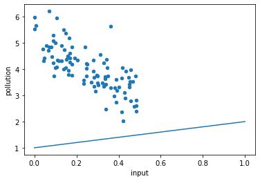
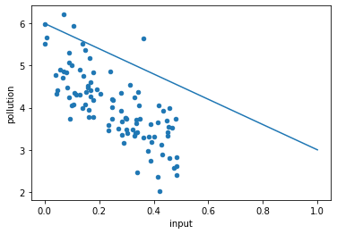

```python
# 실제해보기 1
```


```python
# 패키지 불러오기 (matplotlib / pandas)
import matplotlib.pyplot as plt
import pandas as pd
# 데이터 저장 위치
data_home = "https://github.com/dknife/ML/raw/main/data/"
# 데이터 파일 이름
lin_data = pd.read_csv(data_home+"pollution.csv")
print(lin_data)
```

           input  pollution
    0   0.240557   4.858750
    1   0.159731   4.471091
    2   0.108295   4.341897
    3   0.233770   3.586844
    4   0.283235   3.678243
    ..       ...        ...
    95  0.070824   4.851617
    96  0.055300   4.912696
    97  0.138229   5.516441
    98  0.007205   5.661260
    99  0.290294   3.169049
    
    [100 rows x 2 columns]


```python
# 데이터 시각화 / x축 input y축 pollution / 그래프 형식 scatter
lin_data.plot(kind = 'scatter', x = 'input', y = 'pollution')
```


    <AxesSubplot:xlabel='input', ylabel='pollution'>


    

    


```python
# 변수들 정의
w, b = 1, 1
x0, x1 = 0.0, 1.0

# 가설에 따라 값을 계산하는 함수
def h(x, w, b):
    return w*x + b

# 이전에 그린 산점도를 확인할 수 있는 그래프 그리기
lin_data.plot(kind = 'scatter', x = 'input', y = 'pollution')
# 추가적으로 y = wx+b 직선 표현
plt.plot([x0, x1], [h(x0, w, b), h(x1, w, b)])
```


    [<matplotlib.lines.Line2D at 0x7f399f6f5c10>]


    

    


```python
# 변수들 정의
w, b = -3, 6
x0, x1 = 0.0, 1.0

# 이전에 그린 산점도를 확인할 수 있는 그래프 그리기
lin_data.plot(kind = 'scatter', x = 'input', y = 'pollution')
# 추가적으로 y = wx+b 직선 표현
plt.plot([x0, x1], [h(x0, w, b), h(x1, w, b)])
```


    [<matplotlib.lines.Line2D at 0x7f399f66d430>]


    

    


```python
# 실제해보기 2
```


```python
# 패키지 불러오기
import numpy as np
from sklearn.metrics import mean_squared_error as mse

# 5개 점의 x, y 좌표값
x = np.array([1, 4.5, 9, 10, 13])
y = np.array([0, 0.2, 2.5, 5.4, 7.3])

# 1.0 이하 0.2 초과 범위 내에서 1.0부터 시작하여 -0.1씩 줄어드는 리스트 생성
w_list = np.arange(1.0, 0.2, -0.1)

for w in list(w_list):
    # mse즉 표준 제곱 오차 함수인 mse()를 사용하기 위해 필요한 변수 생성
    y_hat = w * x
    # {:.1f}소숫점 아래 1자리까지 표시 {:.2f}소숫점 아래 2자리까지 표시
    print('w = {:.1f}, 평균제곱 오차: {:.2f}'.format(w, mse(y_hat,y)))
```

    w = 1.0, 평균제곱 오차: 23.08
    w = 0.9, 평균제곱 오차: 15.86
    w = 0.8, 평균제곱 오차: 10.13
    w = 0.7, 평균제곱 오차: 5.89
    w = 0.6, 평균제곱 오차: 3.13
    w = 0.5, 평균제곱 오차: 1.85
    w = 0.4, 평균제곱 오차: 2.06
    w = 0.3, 평균제곱 오차: 3.75

