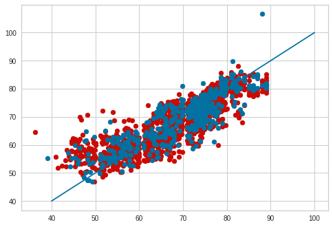
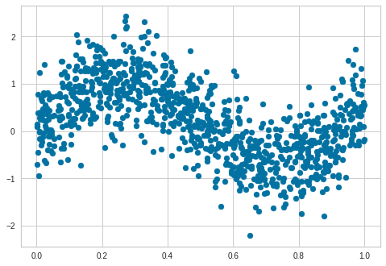
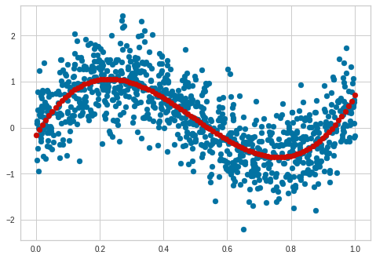
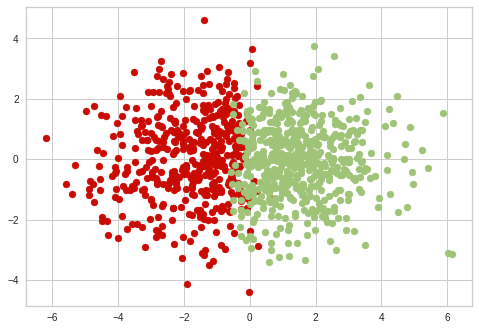
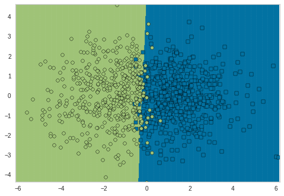
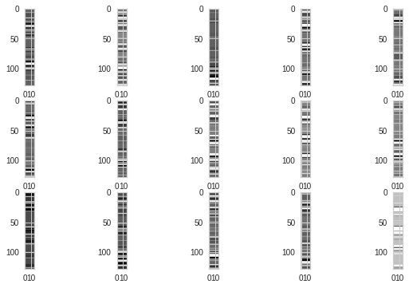
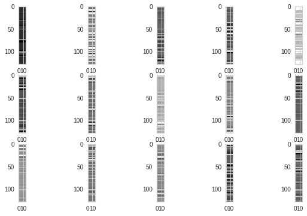
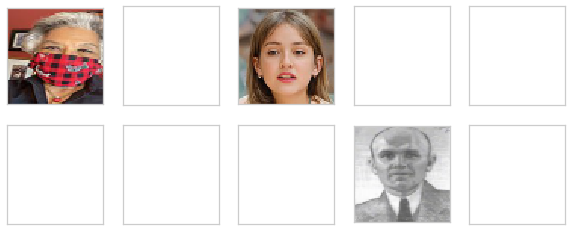

```python
! pip install yellowbrick
```

    Requirement already satisfied: yellowbrick in /opt/conda/lib/python3.8/site-packages (1.5)
    Requirement already satisfied: numpy>=1.16.0 in /opt/conda/lib/python3.8/site-packages (from yellowbrick) (1.19.5)
    Requirement already satisfied: cycler>=0.10.0 in /opt/conda/lib/python3.8/site-packages (from yellowbrick) (0.10.0)
    Requirement already satisfied: matplotlib!=3.0.0,>=2.0.2 in /opt/conda/lib/python3.8/site-packages (from yellowbrick) (3.3.3)
    Requirement already satisfied: scikit-learn>=1.0.0 in /opt/conda/lib/python3.8/site-packages (from yellowbrick) (1.1.3)
    Requirement already satisfied: scipy>=1.0.0 in /opt/conda/lib/python3.8/site-packages (from yellowbrick) (1.5.3)
    Requirement already satisfied: six in /opt/conda/lib/python3.8/site-packages (from cycler>=0.10.0->yellowbrick) (1.15.0)
    Requirement already satisfied: kiwisolver>=1.0.1 in /opt/conda/lib/python3.8/site-packages (from matplotlib!=3.0.0,>=2.0.2->yellowbrick) (1.3.1)
    Requirement already satisfied: pyparsing!=2.0.4,!=2.1.2,!=2.1.6,>=2.0.3 in /opt/conda/lib/python3.8/site-packages (from matplotlib!=3.0.0,>=2.0.2->yellowbrick) (2.4.7)
    Requirement already satisfied: pillow>=6.2.0 in /opt/conda/lib/python3.8/site-packages (from matplotlib!=3.0.0,>=2.0.2->yellowbrick) (8.1.0)
    Requirement already satisfied: python-dateutil>=2.1 in /opt/conda/lib/python3.8/site-packages (from matplotlib!=3.0.0,>=2.0.2->yellowbrick) (2.8.1)
    Requirement already satisfied: joblib>=1.0.0 in /opt/conda/lib/python3.8/site-packages (from scikit-learn>=1.0.0->yellowbrick) (1.0.0)
    Requirement already satisfied: threadpoolctl>=2.0.0 in /opt/conda/lib/python3.8/site-packages (from scikit-learn>=1.0.0->yellowbrick) (2.1.0)


```python
import pandas as pd
import numpy as np
import matplotlib.pyplot as plt
from sklearn.model_selection import train_test_split
from sklearn.linear_model import LinearRegression
from sklearn.metrics import mean_squared_error
from sklearn.preprocessing import PolynomialFeatures
from sklearn.preprocessing import StandardScaler
from sklearn.pipeline import Pipeline
from sklearn.datasets import load_iris
from sklearn.tree import DecisionTreeClassifier
from sklearn.tree import export_graphviz
from sklearn.svm import LinearSVC
from skimage.io import imread
from skimage.transform import resize
from skimage.feature import hog
from sklearn.svm import SVC
from yellowbrick.contrib.classifier import DecisionViz
```


```python
# 데이터 불러오기 및 요약
data_loc = 'https://github.com/dknife/ML/raw/main/data/'
life = pd.read_csv(data_loc + 'life_expectancy.csv', error_bad_lines=False)
life.head()
```


<div>
<style scoped>
    .dataframe tbody tr th:only-of-type {
        vertical-align: middle;
    }

    .dataframe tbody tr th {
        vertical-align: top;
    }

    .dataframe thead th {
        text-align: right;
    }
</style>
<table border="1" class="dataframe">
  <thead>
    <tr style="text-align: right;">
      <th></th>
      <th>Country</th>
      <th>Year</th>
      <th>Status</th>
      <th>Life expectancy</th>
      <th>Adult mortality</th>
      <th>Infant deaths</th>
      <th>Alcohol</th>
      <th>Percentage expenditure</th>
      <th>Hepatitis B</th>
      <th>Measles</th>
      <th>...</th>
      <th>Polio</th>
      <th>Total expenditure</th>
      <th>Diphtheria</th>
      <th>HIV/AIDS</th>
      <th>GDP</th>
      <th>Population</th>
      <th>Thinness 1-19 years</th>
      <th>Thinness 5-9 years</th>
      <th>Income composition of resources</th>
      <th>Schooling</th>
    </tr>
  </thead>
  <tbody>
    <tr>
      <th>0</th>
      <td>Afghanistan</td>
      <td>2015</td>
      <td>Developing</td>
      <td>65.0</td>
      <td>263.0</td>
      <td>62</td>
      <td>0.01</td>
      <td>71.279624</td>
      <td>65.0</td>
      <td>1154</td>
      <td>...</td>
      <td>6.0</td>
      <td>8.16</td>
      <td>65.0</td>
      <td>0.1</td>
      <td>584.259210</td>
      <td>33736494.0</td>
      <td>17.2</td>
      <td>17.3</td>
      <td>0.479</td>
      <td>10.1</td>
    </tr>
    <tr>
      <th>1</th>
      <td>Afghanistan</td>
      <td>2014</td>
      <td>Developing</td>
      <td>59.9</td>
      <td>271.0</td>
      <td>64</td>
      <td>0.01</td>
      <td>73.523582</td>
      <td>62.0</td>
      <td>492</td>
      <td>...</td>
      <td>58.0</td>
      <td>8.18</td>
      <td>62.0</td>
      <td>0.1</td>
      <td>612.696514</td>
      <td>327582.0</td>
      <td>17.5</td>
      <td>17.5</td>
      <td>0.476</td>
      <td>10.0</td>
    </tr>
    <tr>
      <th>2</th>
      <td>Afghanistan</td>
      <td>2013</td>
      <td>Developing</td>
      <td>59.9</td>
      <td>268.0</td>
      <td>66</td>
      <td>0.01</td>
      <td>73.219243</td>
      <td>64.0</td>
      <td>430</td>
      <td>...</td>
      <td>62.0</td>
      <td>8.13</td>
      <td>64.0</td>
      <td>0.1</td>
      <td>631.744976</td>
      <td>31731688.0</td>
      <td>17.7</td>
      <td>17.7</td>
      <td>0.470</td>
      <td>9.9</td>
    </tr>
    <tr>
      <th>3</th>
      <td>Afghanistan</td>
      <td>2012</td>
      <td>Developing</td>
      <td>59.5</td>
      <td>272.0</td>
      <td>69</td>
      <td>0.01</td>
      <td>78.184215</td>
      <td>67.0</td>
      <td>2787</td>
      <td>...</td>
      <td>67.0</td>
      <td>8.52</td>
      <td>67.0</td>
      <td>0.1</td>
      <td>669.959000</td>
      <td>3696958.0</td>
      <td>17.9</td>
      <td>18.0</td>
      <td>0.463</td>
      <td>9.8</td>
    </tr>
    <tr>
      <th>4</th>
      <td>Afghanistan</td>
      <td>2011</td>
      <td>Developing</td>
      <td>59.2</td>
      <td>275.0</td>
      <td>71</td>
      <td>0.01</td>
      <td>7.097109</td>
      <td>68.0</td>
      <td>3013</td>
      <td>...</td>
      <td>68.0</td>
      <td>7.87</td>
      <td>68.0</td>
      <td>0.1</td>
      <td>63.537231</td>
      <td>2978599.0</td>
      <td>18.2</td>
      <td>18.2</td>
      <td>0.454</td>
      <td>9.5</td>
    </tr>
  </tbody>
</table>
<p>5 rows × 22 columns</p>
</div>


```python
# 데이터중 필요한 열만 인덱싱
life = life[['Life expectancy', 'Alcohol', 'Percentage expenditure', 'Polio', 'BMI', 'GDP', 'Thinness 1-19 years']]

# na결측값 바로 제거
life.dropna(inplace = True)

# 입력값과 출력값 구분
X = life[['Alcohol', 'Percentage expenditure', 'Polio', 'BMI', 'GDP', 'Thinness 1-19 years']]
y = life['Life expectancy']
```


```python
# 3차 다항식으로 다항회귀 모델 선언
poly_feature = PolynomialFeatures(degree = 3)

# 선언한 다항회귀 모델 변환
X = poly_feature.fit_transform(X)
```


```python
# 데이터들을 훈련데이터와 검증데이터로 분리
X_train, X_test, y_train, y_test = train_test_split(X,y, test_size = 0.2)

# 선형회귀 모델 선언
lin_model = LinearRegression()

# 훈련데이터로 모델 훈련
lin_model.fit(X_train, y_train)

# 훈련데이터의 예측값
y_hat_train = lin_model.predict(X_train)

# 검증 데이터의 예측값
y_hat_test = lin_model.predict(X_test)

# 두 예측값을 그래프로 표현, 이때 훈련데이터를 빨간색/검증데이터를 파란색으로 지정
plt.scatter(y_train, y_hat_train, color='r')
plt.scatter(y_test, y_hat_test, color='b')

# 데이터들의 기준이 되는 선 그리기
plt.plot([40,100], [40, 100])

# 훈련시킨 모델들의 MSE 출력
print("Mean Squared Error:", mean_squared_error(y_test,y_hat_test))
```

    Mean Squared Error: 25.456442760072267


    

    


```python
# LAB 6-1 다항 회귀의 회귀 함수를 그려 보자
# 학습에 필요한 데이터 불러오기
data_loc = 'https://github.com/dknife/ML/raw/main/data/'
df = pd.read_csv(data_loc + 'nonlinear.csv', error_bad_lines=False)

# 데이터 분포 표현
plt.scatter(df['x'], df['y'])
```


    <matplotlib.collections.PathCollection at 0x7f586c4fdfa0>


    

    


```python
# 3차 다항 회귀를 위해 데이터 변환
# x와y값을 넘파이 배열로 변경
X = df['x'].to_numpy()
y = df['y'].to_numpy()

# 입력값을 2차원 벡터로 변환
X = X.reshape(-1,1)
# 3차 다항회귀를 할 수 있게 데이터 변환
feature_cubic = PolynomialFeatures(degree = 3)
X_3 = feature_cubic.fit_transform(X)
```


```python
# 선형회귀 모델 선언
lin_model = LinearRegression()
# 0부터 1까지 100개의 데이터로 2차원 배열 생성
domain = np.linspace(0, 1, 100).reshape(-1,1)
```


```python
# 모델 학습
lin_model.fit(X_3, y)
# 다항회귀를 할수 있도록 입력용 데이터 형식 변환
domain_3 = feature_cubic.fit_transform(domain)
# domain _3에대한 예측
predictions = lin_model.predict(domain_3)
# 학습용 데이터 분포 그리기
plt.scatter(df['x'], df['y'])
# 학습한 모델 표현
plt.scatter(domain, predictions, color='r')
```


    <matplotlib.collections.PathCollection at 0x7f586c56a5b0>


    

    


```python
# iris 데이터 불러오기
iris = load_iris()
X, y = iris.data, iris.target

# 결정 트리 선언
dec_tree = DecisionTreeClassifier(max_depth=3)
# 결정 트리 훈련
dec_tree.fit(X,y)
```


<style>#sk-container-id-1 {color: black;background-color: white;}#sk-container-id-1 pre{padding: 0;}#sk-container-id-1 div.sk-toggleable {background-color: white;}#sk-container-id-1 label.sk-toggleable__label {cursor: pointer;display: block;width: 100%;margin-bottom: 0;padding: 0.3em;box-sizing: border-box;text-align: center;}#sk-container-id-1 label.sk-toggleable__label-arrow:before {content: "▸";float: left;margin-right: 0.25em;color: #696969;}#sk-container-id-1 label.sk-toggleable__label-arrow:hover:before {color: black;}#sk-container-id-1 div.sk-estimator:hover label.sk-toggleable__label-arrow:before {color: black;}#sk-container-id-1 div.sk-toggleable__content {max-height: 0;max-width: 0;overflow: hidden;text-align: left;background-color: #f0f8ff;}#sk-container-id-1 div.sk-toggleable__content pre {margin: 0.2em;color: black;border-radius: 0.25em;background-color: #f0f8ff;}#sk-container-id-1 input.sk-toggleable__control:checked~div.sk-toggleable__content {max-height: 200px;max-width: 100%;overflow: auto;}#sk-container-id-1 input.sk-toggleable__control:checked~label.sk-toggleable__label-arrow:before {content: "▾";}#sk-container-id-1 div.sk-estimator input.sk-toggleable__control:checked~label.sk-toggleable__label {background-color: #d4ebff;}#sk-container-id-1 div.sk-label input.sk-toggleable__control:checked~label.sk-toggleable__label {background-color: #d4ebff;}#sk-container-id-1 input.sk-hidden--visually {border: 0;clip: rect(1px 1px 1px 1px);clip: rect(1px, 1px, 1px, 1px);height: 1px;margin: -1px;overflow: hidden;padding: 0;position: absolute;width: 1px;}#sk-container-id-1 div.sk-estimator {font-family: monospace;background-color: #f0f8ff;border: 1px dotted black;border-radius: 0.25em;box-sizing: border-box;margin-bottom: 0.5em;}#sk-container-id-1 div.sk-estimator:hover {background-color: #d4ebff;}#sk-container-id-1 div.sk-parallel-item::after {content: "";width: 100%;border-bottom: 1px solid gray;flex-grow: 1;}#sk-container-id-1 div.sk-label:hover label.sk-toggleable__label {background-color: #d4ebff;}#sk-container-id-1 div.sk-serial::before {content: "";position: absolute;border-left: 1px solid gray;box-sizing: border-box;top: 0;bottom: 0;left: 50%;z-index: 0;}#sk-container-id-1 div.sk-serial {display: flex;flex-direction: column;align-items: center;background-color: white;padding-right: 0.2em;padding-left: 0.2em;position: relative;}#sk-container-id-1 div.sk-item {position: relative;z-index: 1;}#sk-container-id-1 div.sk-parallel {display: flex;align-items: stretch;justify-content: center;background-color: white;position: relative;}#sk-container-id-1 div.sk-item::before, #sk-container-id-1 div.sk-parallel-item::before {content: "";position: absolute;border-left: 1px solid gray;box-sizing: border-box;top: 0;bottom: 0;left: 50%;z-index: -1;}#sk-container-id-1 div.sk-parallel-item {display: flex;flex-direction: column;z-index: 1;position: relative;background-color: white;}#sk-container-id-1 div.sk-parallel-item:first-child::after {align-self: flex-end;width: 50%;}#sk-container-id-1 div.sk-parallel-item:last-child::after {align-self: flex-start;width: 50%;}#sk-container-id-1 div.sk-parallel-item:only-child::after {width: 0;}#sk-container-id-1 div.sk-dashed-wrapped {border: 1px dashed gray;margin: 0 0.4em 0.5em 0.4em;box-sizing: border-box;padding-bottom: 0.4em;background-color: white;}#sk-container-id-1 div.sk-label label {font-family: monospace;font-weight: bold;display: inline-block;line-height: 1.2em;}#sk-container-id-1 div.sk-label-container {text-align: center;}#sk-container-id-1 div.sk-container {/* jupyter's `normalize.less` sets `[hidden] { display: none; }` but bootstrap.min.css set `[hidden] { display: none !important; }` so we also need the `!important` here to be able to override the default hidden behavior on the sphinx rendered scikit-learn.org. See: https://github.com/scikit-learn/scikit-learn/issues/21755 */display: inline-block !important;position: relative;}#sk-container-id-1 div.sk-text-repr-fallback {display: none;}</style><div id="sk-container-id-1" class="sk-top-container"><div class="sk-text-repr-fallback"><pre>DecisionTreeClassifier(max_depth=3)</pre><b>In a Jupyter environment, please rerun this cell to show the HTML representation or trust the notebook. <br />On GitHub, the HTML representation is unable to render, please try loading this page with nbviewer.org.</b></div><div class="sk-container" hidden><div class="sk-item"><div class="sk-estimator sk-toggleable"><input class="sk-toggleable__control sk-hidden--visually" id="sk-estimator-id-1" type="checkbox" checked><label for="sk-estimator-id-1" class="sk-toggleable__label sk-toggleable__label-arrow">DecisionTreeClassifier</label><div class="sk-toggleable__content"><pre>DecisionTreeClassifier(max_depth=3)</pre></div></div></div></div></div>


```python
export_graphviz(
    dec_tree,
    out_file = ("./dec_tree_for_iris.dot"),
    feature_names = iris.feature_names,
)
```


```python
!dot -Tjpg dec_tree_for_iris.dot -o dec_tree_for_iris.jpg

dec_tree_img = plt.imread('./dec_tree_for_iris.jpg')
plt.figure(num=None, figsize=(12, 8), dpi=80,
          facecolor='w', edgecolor='k')
plt.imshow(dec_tree_img)
```

    /bin/bash: dot: command not found


    ---------------------------------------------------------------------------

    FileNotFoundError                         Traceback (most recent call last)

    <ipython-input-13-5c5dce4baaa5> in <module>
          1 get_ipython().system('dot -Tjpg dec_tree_for_iris.dot -o dec_tree_for_iris.jpg')
          2 
    ----> 3 dec_tree_img = plt.imread('./dec_tree_for_iris.jpg')
          4 plt.figure(num=None, figsize=(12, 8), dpi=80,
          5           facecolor='w', edgecolor='k')


    /opt/conda/lib/python3.8/site-packages/matplotlib/pyplot.py in imread(fname, format)
       2244 @_copy_docstring_and_deprecators(matplotlib.image.imread)
       2245 def imread(fname, format=None):
    -> 2246     return matplotlib.image.imread(fname, format)
       2247 
       2248 


    /opt/conda/lib/python3.8/site-packages/matplotlib/image.py in imread(fname, format)
       1494                     response = io.BytesIO(response.read())
       1495                 return imread(response, format=ext)
    -> 1496     with img_open(fname) as image:
       1497         return (_pil_png_to_float_array(image)
       1498                 if isinstance(image, PIL.PngImagePlugin.PngImageFile) else


    /opt/conda/lib/python3.8/site-packages/PIL/Image.py in open(fp, mode, formats)
       2902 
       2903     if filename:
    -> 2904         fp = builtins.open(filename, "rb")
       2905         exclusive_fp = True
       2906 


    FileNotFoundError: [Errno 2] No such file or directory: './dec_tree_for_iris.jpg'


```python
iris = load_iris()
X, y = iris.data, iris.target
dec_tree = DecisionTreeClassifier(max_depth=3, criterion = 'entropy')
dec_tree.fit(X,y)
```


<style>#sk-container-id-2 {color: black;background-color: white;}#sk-container-id-2 pre{padding: 0;}#sk-container-id-2 div.sk-toggleable {background-color: white;}#sk-container-id-2 label.sk-toggleable__label {cursor: pointer;display: block;width: 100%;margin-bottom: 0;padding: 0.3em;box-sizing: border-box;text-align: center;}#sk-container-id-2 label.sk-toggleable__label-arrow:before {content: "▸";float: left;margin-right: 0.25em;color: #696969;}#sk-container-id-2 label.sk-toggleable__label-arrow:hover:before {color: black;}#sk-container-id-2 div.sk-estimator:hover label.sk-toggleable__label-arrow:before {color: black;}#sk-container-id-2 div.sk-toggleable__content {max-height: 0;max-width: 0;overflow: hidden;text-align: left;background-color: #f0f8ff;}#sk-container-id-2 div.sk-toggleable__content pre {margin: 0.2em;color: black;border-radius: 0.25em;background-color: #f0f8ff;}#sk-container-id-2 input.sk-toggleable__control:checked~div.sk-toggleable__content {max-height: 200px;max-width: 100%;overflow: auto;}#sk-container-id-2 input.sk-toggleable__control:checked~label.sk-toggleable__label-arrow:before {content: "▾";}#sk-container-id-2 div.sk-estimator input.sk-toggleable__control:checked~label.sk-toggleable__label {background-color: #d4ebff;}#sk-container-id-2 div.sk-label input.sk-toggleable__control:checked~label.sk-toggleable__label {background-color: #d4ebff;}#sk-container-id-2 input.sk-hidden--visually {border: 0;clip: rect(1px 1px 1px 1px);clip: rect(1px, 1px, 1px, 1px);height: 1px;margin: -1px;overflow: hidden;padding: 0;position: absolute;width: 1px;}#sk-container-id-2 div.sk-estimator {font-family: monospace;background-color: #f0f8ff;border: 1px dotted black;border-radius: 0.25em;box-sizing: border-box;margin-bottom: 0.5em;}#sk-container-id-2 div.sk-estimator:hover {background-color: #d4ebff;}#sk-container-id-2 div.sk-parallel-item::after {content: "";width: 100%;border-bottom: 1px solid gray;flex-grow: 1;}#sk-container-id-2 div.sk-label:hover label.sk-toggleable__label {background-color: #d4ebff;}#sk-container-id-2 div.sk-serial::before {content: "";position: absolute;border-left: 1px solid gray;box-sizing: border-box;top: 0;bottom: 0;left: 50%;z-index: 0;}#sk-container-id-2 div.sk-serial {display: flex;flex-direction: column;align-items: center;background-color: white;padding-right: 0.2em;padding-left: 0.2em;position: relative;}#sk-container-id-2 div.sk-item {position: relative;z-index: 1;}#sk-container-id-2 div.sk-parallel {display: flex;align-items: stretch;justify-content: center;background-color: white;position: relative;}#sk-container-id-2 div.sk-item::before, #sk-container-id-2 div.sk-parallel-item::before {content: "";position: absolute;border-left: 1px solid gray;box-sizing: border-box;top: 0;bottom: 0;left: 50%;z-index: -1;}#sk-container-id-2 div.sk-parallel-item {display: flex;flex-direction: column;z-index: 1;position: relative;background-color: white;}#sk-container-id-2 div.sk-parallel-item:first-child::after {align-self: flex-end;width: 50%;}#sk-container-id-2 div.sk-parallel-item:last-child::after {align-self: flex-start;width: 50%;}#sk-container-id-2 div.sk-parallel-item:only-child::after {width: 0;}#sk-container-id-2 div.sk-dashed-wrapped {border: 1px dashed gray;margin: 0 0.4em 0.5em 0.4em;box-sizing: border-box;padding-bottom: 0.4em;background-color: white;}#sk-container-id-2 div.sk-label label {font-family: monospace;font-weight: bold;display: inline-block;line-height: 1.2em;}#sk-container-id-2 div.sk-label-container {text-align: center;}#sk-container-id-2 div.sk-container {/* jupyter's `normalize.less` sets `[hidden] { display: none; }` but bootstrap.min.css set `[hidden] { display: none !important; }` so we also need the `!important` here to be able to override the default hidden behavior on the sphinx rendered scikit-learn.org. See: https://github.com/scikit-learn/scikit-learn/issues/21755 */display: inline-block !important;position: relative;}#sk-container-id-2 div.sk-text-repr-fallback {display: none;}</style><div id="sk-container-id-2" class="sk-top-container"><div class="sk-text-repr-fallback"><pre>DecisionTreeClassifier(criterion=&#x27;entropy&#x27;, max_depth=3)</pre><b>In a Jupyter environment, please rerun this cell to show the HTML representation or trust the notebook. <br />On GitHub, the HTML representation is unable to render, please try loading this page with nbviewer.org.</b></div><div class="sk-container" hidden><div class="sk-item"><div class="sk-estimator sk-toggleable"><input class="sk-toggleable__control sk-hidden--visually" id="sk-estimator-id-2" type="checkbox" checked><label for="sk-estimator-id-2" class="sk-toggleable__label sk-toggleable__label-arrow">DecisionTreeClassifier</label><div class="sk-toggleable__content"><pre>DecisionTreeClassifier(criterion=&#x27;entropy&#x27;, max_depth=3)</pre></div></div></div></div></div>


```python
export_graphviz(
    dec_tree,
    out_file=("./dec_tree_for_iris.dot"),
    feature_names=iris.feature_names,
)
```


```python
!dot -Tjpg dec_tree_for_iris.dot -o dec_tree_for_iris.jpg

dec_tree_img = plt.imread('./dec_tree_for_iris.jpg')
plt.figure(num=None, figsize=(12, 8), dpi=80,
          facecolor='w', edgecolor='k')
plt.imshow(dec_tree_img)
```

    /bin/bash: dot: command not found


    ---------------------------------------------------------------------------

    FileNotFoundError                         Traceback (most recent call last)

    <ipython-input-16-5c5dce4baaa5> in <module>
          1 get_ipython().system('dot -Tjpg dec_tree_for_iris.dot -o dec_tree_for_iris.jpg')
          2 
    ----> 3 dec_tree_img = plt.imread('./dec_tree_for_iris.jpg')
          4 plt.figure(num=None, figsize=(12, 8), dpi=80,
          5           facecolor='w', edgecolor='k')


    /opt/conda/lib/python3.8/site-packages/matplotlib/pyplot.py in imread(fname, format)
       2244 @_copy_docstring_and_deprecators(matplotlib.image.imread)
       2245 def imread(fname, format=None):
    -> 2246     return matplotlib.image.imread(fname, format)
       2247 
       2248 


    /opt/conda/lib/python3.8/site-packages/matplotlib/image.py in imread(fname, format)
       1494                     response = io.BytesIO(response.read())
       1495                 return imread(response, format=ext)
    -> 1496     with img_open(fname) as image:
       1497         return (_pil_png_to_float_array(image)
       1498                 if isinstance(image, PIL.PngImagePlugin.PngImageFile) else


    /opt/conda/lib/python3.8/site-packages/PIL/Image.py in open(fp, mode, formats)
       2902 
       2903     if filename:
    -> 2904         fp = builtins.open(filename, "rb")
       2905         exclusive_fp = True
       2906 


    FileNotFoundError: [Errno 2] No such file or directory: './dec_tree_for_iris.jpg'


```python
data_loc = 'https://github.com/dknife/ML/raw/main/data/'
df = pd.read_csv(data_loc+'two_classes.csv', error_bad_lines=False)
df.tail(5)
```


<div>
<style scoped>
    .dataframe tbody tr th:only-of-type {
        vertical-align: middle;
    }

    .dataframe tbody tr th {
        vertical-align: top;
    }

    .dataframe thead th {
        text-align: right;
    }
</style>
<table border="1" class="dataframe">
  <thead>
    <tr style="text-align: right;">
      <th></th>
      <th>x1</th>
      <th>x2</th>
      <th>y</th>
    </tr>
  </thead>
  <tbody>
    <tr>
      <th>995</th>
      <td>2.664896</td>
      <td>-1.955326</td>
      <td>0</td>
    </tr>
    <tr>
      <th>996</th>
      <td>-2.019928</td>
      <td>0.334542</td>
      <td>1</td>
    </tr>
    <tr>
      <th>997</th>
      <td>-4.634470</td>
      <td>0.300158</td>
      <td>1</td>
    </tr>
    <tr>
      <th>998</th>
      <td>1.426275</td>
      <td>-2.765590</td>
      <td>0</td>
    </tr>
    <tr>
      <th>999</th>
      <td>1.988053</td>
      <td>1.466494</td>
      <td>0</td>
    </tr>
  </tbody>
</table>
</div>


```python
# y가 1인 데이터만 추출
df_positive = df[df['y']>0]
# y가 0인 데이터만 추출
df_negative = df[df['y']==0]

plt.scatter(df_positive['x1'], df_positive['x2'], color='r')
plt.scatter(df_negative['x1'], df_negative['x2'], color='g')
```


    <matplotlib.collections.PathCollection at 0x7f58ffef5340>


    

    


```python
# x1, x2를 입력 벡터로 한다
X = df[['x1', 'x2']].to_numpy()
# y열의 값이 레이블
y = df['y']
# SVM클래스 생성
svm_simple = LinearSVC(C=1, loss = 'hinge')
# 입력과 레이블로 SVM 학습 실시
svm_simple.fit(X,y)
```


<style>#sk-container-id-3 {color: black;background-color: white;}#sk-container-id-3 pre{padding: 0;}#sk-container-id-3 div.sk-toggleable {background-color: white;}#sk-container-id-3 label.sk-toggleable__label {cursor: pointer;display: block;width: 100%;margin-bottom: 0;padding: 0.3em;box-sizing: border-box;text-align: center;}#sk-container-id-3 label.sk-toggleable__label-arrow:before {content: "▸";float: left;margin-right: 0.25em;color: #696969;}#sk-container-id-3 label.sk-toggleable__label-arrow:hover:before {color: black;}#sk-container-id-3 div.sk-estimator:hover label.sk-toggleable__label-arrow:before {color: black;}#sk-container-id-3 div.sk-toggleable__content {max-height: 0;max-width: 0;overflow: hidden;text-align: left;background-color: #f0f8ff;}#sk-container-id-3 div.sk-toggleable__content pre {margin: 0.2em;color: black;border-radius: 0.25em;background-color: #f0f8ff;}#sk-container-id-3 input.sk-toggleable__control:checked~div.sk-toggleable__content {max-height: 200px;max-width: 100%;overflow: auto;}#sk-container-id-3 input.sk-toggleable__control:checked~label.sk-toggleable__label-arrow:before {content: "▾";}#sk-container-id-3 div.sk-estimator input.sk-toggleable__control:checked~label.sk-toggleable__label {background-color: #d4ebff;}#sk-container-id-3 div.sk-label input.sk-toggleable__control:checked~label.sk-toggleable__label {background-color: #d4ebff;}#sk-container-id-3 input.sk-hidden--visually {border: 0;clip: rect(1px 1px 1px 1px);clip: rect(1px, 1px, 1px, 1px);height: 1px;margin: -1px;overflow: hidden;padding: 0;position: absolute;width: 1px;}#sk-container-id-3 div.sk-estimator {font-family: monospace;background-color: #f0f8ff;border: 1px dotted black;border-radius: 0.25em;box-sizing: border-box;margin-bottom: 0.5em;}#sk-container-id-3 div.sk-estimator:hover {background-color: #d4ebff;}#sk-container-id-3 div.sk-parallel-item::after {content: "";width: 100%;border-bottom: 1px solid gray;flex-grow: 1;}#sk-container-id-3 div.sk-label:hover label.sk-toggleable__label {background-color: #d4ebff;}#sk-container-id-3 div.sk-serial::before {content: "";position: absolute;border-left: 1px solid gray;box-sizing: border-box;top: 0;bottom: 0;left: 50%;z-index: 0;}#sk-container-id-3 div.sk-serial {display: flex;flex-direction: column;align-items: center;background-color: white;padding-right: 0.2em;padding-left: 0.2em;position: relative;}#sk-container-id-3 div.sk-item {position: relative;z-index: 1;}#sk-container-id-3 div.sk-parallel {display: flex;align-items: stretch;justify-content: center;background-color: white;position: relative;}#sk-container-id-3 div.sk-item::before, #sk-container-id-3 div.sk-parallel-item::before {content: "";position: absolute;border-left: 1px solid gray;box-sizing: border-box;top: 0;bottom: 0;left: 50%;z-index: -1;}#sk-container-id-3 div.sk-parallel-item {display: flex;flex-direction: column;z-index: 1;position: relative;background-color: white;}#sk-container-id-3 div.sk-parallel-item:first-child::after {align-self: flex-end;width: 50%;}#sk-container-id-3 div.sk-parallel-item:last-child::after {align-self: flex-start;width: 50%;}#sk-container-id-3 div.sk-parallel-item:only-child::after {width: 0;}#sk-container-id-3 div.sk-dashed-wrapped {border: 1px dashed gray;margin: 0 0.4em 0.5em 0.4em;box-sizing: border-box;padding-bottom: 0.4em;background-color: white;}#sk-container-id-3 div.sk-label label {font-family: monospace;font-weight: bold;display: inline-block;line-height: 1.2em;}#sk-container-id-3 div.sk-label-container {text-align: center;}#sk-container-id-3 div.sk-container {/* jupyter's `normalize.less` sets `[hidden] { display: none; }` but bootstrap.min.css set `[hidden] { display: none !important; }` so we also need the `!important` here to be able to override the default hidden behavior on the sphinx rendered scikit-learn.org. See: https://github.com/scikit-learn/scikit-learn/issues/21755 */display: inline-block !important;position: relative;}#sk-container-id-3 div.sk-text-repr-fallback {display: none;}</style><div id="sk-container-id-3" class="sk-top-container"><div class="sk-text-repr-fallback"><pre>LinearSVC(C=1, loss=&#x27;hinge&#x27;)</pre><b>In a Jupyter environment, please rerun this cell to show the HTML representation or trust the notebook. <br />On GitHub, the HTML representation is unable to render, please try loading this page with nbviewer.org.</b></div><div class="sk-container" hidden><div class="sk-item"><div class="sk-estimator sk-toggleable"><input class="sk-toggleable__control sk-hidden--visually" id="sk-estimator-id-3" type="checkbox" checked><label for="sk-estimator-id-3" class="sk-toggleable__label sk-toggleable__label-arrow">LinearSVC</label><div class="sk-toggleable__content"><pre>LinearSVC(C=1, loss=&#x27;hinge&#x27;)</pre></div></div></div></div></div>


```python
svm_simple.predict([[0.12, 0.56], [-4,40], [0,40], [5, 20]])
```


    array([0, 1, 1, 0])


```python
viz = DecisionViz(svm_simple, title="linear SVM")
viz.fit(X, y)
viz.draw(X, y)
```

    /opt/conda/lib/python3.8/site-packages/yellowbrick/contrib/classifier/boundaries.py:435: MatplotlibDeprecationWarning: shading='flat' when X and Y have the same dimensions as C is deprecated since 3.3.  Either specify the corners of the quadrilaterals with X and Y, or pass shading='auto', 'nearest' or 'gouraud', or set rcParams['pcolor.shading'].  This will become an error two minor releases later.
      self.ax.pcolormesh(


    

    


```python
# 해보기 5 - 얼굴 찾기: SVM으로 분류하기
```


```python
url = "https://github.com/dknife/ML/raw/main/data/Proj2/faces/"

face_images = []

for i in range(15):
    # 이미지 파일 이름을 만든다
    file = url + 'img{0:02d}.jpg'.format(i+1)
    # 이미지를 읽는다
    img = imread(file)
    # 이미지의 크기를 변경한다
    img = resize(img, (64,64))
    # face_images에 담는다
    face_images.append(img)
```


```python
url = 'https://github.com/dknife/ML/raw/main/data/Proj2/faces/'

face_images = []

for i in range(15):
    # 이미지 파일 이름을 만든다
    file = url + 'img{0:02d}.jpg'.format(i+1)
    # 이미지를 읽는다
    img = imread(file)
    # 이미지의 크기를 변경한다
    img = resize(img, (64,64))
    face_images.append(img)
```


```python
face_hogs = []
face_features = []

# hog()함수를 수행하고 디스크립터와 가시화 이미지를 차례로 배열에 담았다.
for i in range(15):
    hog_desc, hog_image = hog(face_images[i], orientations=8,
                             pixels_per_cell=(16,16), cells_per_block=(1,1),
                              visualize=True, multichannel=True)
    face_hogs.append(hog_image)
    face_features.append(hog_desc)
    
# 계속 plot_images가 정의되어 있지 않다하고 따로 구글링하여도 찾지 못하여 주석처리 하였습니다.
#plot_images(3, 5, face_hogs)
```


    ---------------------------------------------------------------------------

    NameError                                 Traceback (most recent call last)

    <ipython-input-49-9b9155b1bff2> in <module>
          9     face_features.append(hog_desc)
         10 
    ---> 11 plot_images(3, 5, face_hogs)
    

    NameError: name 'plot_images' is not defined


```python
# 한 블록당 8개 방향의 정보가 담겨있어 16*8 개의 숫자로 이루어진 (128,) 크기의 배열이 된다.
print(face_features[0].shape)
```

    (128,)


```python
fig = plt.figure()
fig, ax = plt.subplots(3,5, figsize = (10,6))
for i in range(3):
    for j in range(5):
        ax[i, j].imshow( resize(face_features[i*5+j], (128,16)))
```


    <Figure size 576x396 with 0 Axes>


    

    


```python
# 사람 얼굴을 준비하는 것처럼 동물 이미지를 준비한다.
url = 'https://github.com/dknife/ML/raw/main/data/Proj2/animals/'
animal_images=[]

for i in range(15):
    file = url + 'img{0:02d}.jpg'.format(i+1)
    img = imread(file)
    img = resize(img, (64,64))
    animal_images.append(img)

#plot_images(3, 5, animal_images)
    
animal_hogs = []
animal_features = []

for i in range(15):
    hog_desc, hog_image = hog(animal_images[i], orientations=8,
                             pixels_per_cell=(16,16), cells_per_block=(1,1),
                             visualize=True, multichannel=True)
    animal_hogs.append(hog_image)
    animal_features.append(hog_desc)

# plot_images(3, 5, animal_hogs)    

fig = plt.figure()
fig, ax = plt.subplots(3,5, figsize = (10,6))
for i in range(3):
    for j in range(5):
        ax[i, j].imshow(resize(animal_features[i*5+j], (128,16)))
```


    <Figure size 576x396 with 0 Axes>


    

    


```python
X, y = [], []

for feature in face_features:
    X.append(feature)
    y.append(1)
for feature in animal_features:
    X.append(feature)
    y.append(0)
print(y)
```

    [1, 1, 1, 1, 1, 1, 1, 1, 1, 1, 1, 1, 1, 1, 1, 0, 0, 0, 0, 0, 0, 0, 0, 0, 0, 0, 0, 0, 0, 0]


```python
polynomial_svm_clf = Pipeline([
    ("scaler", StandardScaler()),
    ("svm_clf", SVC(C=1, kernel = 'poly', degree=5, coef0=10.0))
])
polynomial_svm_clf.fit(X,y)
```


<style>#sk-container-id-4 {color: black;background-color: white;}#sk-container-id-4 pre{padding: 0;}#sk-container-id-4 div.sk-toggleable {background-color: white;}#sk-container-id-4 label.sk-toggleable__label {cursor: pointer;display: block;width: 100%;margin-bottom: 0;padding: 0.3em;box-sizing: border-box;text-align: center;}#sk-container-id-4 label.sk-toggleable__label-arrow:before {content: "▸";float: left;margin-right: 0.25em;color: #696969;}#sk-container-id-4 label.sk-toggleable__label-arrow:hover:before {color: black;}#sk-container-id-4 div.sk-estimator:hover label.sk-toggleable__label-arrow:before {color: black;}#sk-container-id-4 div.sk-toggleable__content {max-height: 0;max-width: 0;overflow: hidden;text-align: left;background-color: #f0f8ff;}#sk-container-id-4 div.sk-toggleable__content pre {margin: 0.2em;color: black;border-radius: 0.25em;background-color: #f0f8ff;}#sk-container-id-4 input.sk-toggleable__control:checked~div.sk-toggleable__content {max-height: 200px;max-width: 100%;overflow: auto;}#sk-container-id-4 input.sk-toggleable__control:checked~label.sk-toggleable__label-arrow:before {content: "▾";}#sk-container-id-4 div.sk-estimator input.sk-toggleable__control:checked~label.sk-toggleable__label {background-color: #d4ebff;}#sk-container-id-4 div.sk-label input.sk-toggleable__control:checked~label.sk-toggleable__label {background-color: #d4ebff;}#sk-container-id-4 input.sk-hidden--visually {border: 0;clip: rect(1px 1px 1px 1px);clip: rect(1px, 1px, 1px, 1px);height: 1px;margin: -1px;overflow: hidden;padding: 0;position: absolute;width: 1px;}#sk-container-id-4 div.sk-estimator {font-family: monospace;background-color: #f0f8ff;border: 1px dotted black;border-radius: 0.25em;box-sizing: border-box;margin-bottom: 0.5em;}#sk-container-id-4 div.sk-estimator:hover {background-color: #d4ebff;}#sk-container-id-4 div.sk-parallel-item::after {content: "";width: 100%;border-bottom: 1px solid gray;flex-grow: 1;}#sk-container-id-4 div.sk-label:hover label.sk-toggleable__label {background-color: #d4ebff;}#sk-container-id-4 div.sk-serial::before {content: "";position: absolute;border-left: 1px solid gray;box-sizing: border-box;top: 0;bottom: 0;left: 50%;z-index: 0;}#sk-container-id-4 div.sk-serial {display: flex;flex-direction: column;align-items: center;background-color: white;padding-right: 0.2em;padding-left: 0.2em;position: relative;}#sk-container-id-4 div.sk-item {position: relative;z-index: 1;}#sk-container-id-4 div.sk-parallel {display: flex;align-items: stretch;justify-content: center;background-color: white;position: relative;}#sk-container-id-4 div.sk-item::before, #sk-container-id-4 div.sk-parallel-item::before {content: "";position: absolute;border-left: 1px solid gray;box-sizing: border-box;top: 0;bottom: 0;left: 50%;z-index: -1;}#sk-container-id-4 div.sk-parallel-item {display: flex;flex-direction: column;z-index: 1;position: relative;background-color: white;}#sk-container-id-4 div.sk-parallel-item:first-child::after {align-self: flex-end;width: 50%;}#sk-container-id-4 div.sk-parallel-item:last-child::after {align-self: flex-start;width: 50%;}#sk-container-id-4 div.sk-parallel-item:only-child::after {width: 0;}#sk-container-id-4 div.sk-dashed-wrapped {border: 1px dashed gray;margin: 0 0.4em 0.5em 0.4em;box-sizing: border-box;padding-bottom: 0.4em;background-color: white;}#sk-container-id-4 div.sk-label label {font-family: monospace;font-weight: bold;display: inline-block;line-height: 1.2em;}#sk-container-id-4 div.sk-label-container {text-align: center;}#sk-container-id-4 div.sk-container {/* jupyter's `normalize.less` sets `[hidden] { display: none; }` but bootstrap.min.css set `[hidden] { display: none !important; }` so we also need the `!important` here to be able to override the default hidden behavior on the sphinx rendered scikit-learn.org. See: https://github.com/scikit-learn/scikit-learn/issues/21755 */display: inline-block !important;position: relative;}#sk-container-id-4 div.sk-text-repr-fallback {display: none;}</style><div id="sk-container-id-4" class="sk-top-container"><div class="sk-text-repr-fallback"><pre>Pipeline(steps=[(&#x27;scaler&#x27;, StandardScaler()),
                (&#x27;svm_clf&#x27;, SVC(C=1, coef0=10.0, degree=5, kernel=&#x27;poly&#x27;))])</pre><b>In a Jupyter environment, please rerun this cell to show the HTML representation or trust the notebook. <br />On GitHub, the HTML representation is unable to render, please try loading this page with nbviewer.org.</b></div><div class="sk-container" hidden><div class="sk-item sk-dashed-wrapped"><div class="sk-label-container"><div class="sk-label sk-toggleable"><input class="sk-toggleable__control sk-hidden--visually" id="sk-estimator-id-4" type="checkbox" ><label for="sk-estimator-id-4" class="sk-toggleable__label sk-toggleable__label-arrow">Pipeline</label><div class="sk-toggleable__content"><pre>Pipeline(steps=[(&#x27;scaler&#x27;, StandardScaler()),
                (&#x27;svm_clf&#x27;, SVC(C=1, coef0=10.0, degree=5, kernel=&#x27;poly&#x27;))])</pre></div></div></div><div class="sk-serial"><div class="sk-item"><div class="sk-estimator sk-toggleable"><input class="sk-toggleable__control sk-hidden--visually" id="sk-estimator-id-5" type="checkbox" ><label for="sk-estimator-id-5" class="sk-toggleable__label sk-toggleable__label-arrow">StandardScaler</label><div class="sk-toggleable__content"><pre>StandardScaler()</pre></div></div></div><div class="sk-item"><div class="sk-estimator sk-toggleable"><input class="sk-toggleable__control sk-hidden--visually" id="sk-estimator-id-6" type="checkbox" ><label for="sk-estimator-id-6" class="sk-toggleable__label sk-toggleable__label-arrow">SVC</label><div class="sk-toggleable__content"><pre>SVC(C=1, coef0=10.0, degree=5, kernel=&#x27;poly&#x27;)</pre></div></div></div></div></div></div></div>


```python
yhat = polynomial_svm_clf.predict(X)
print(yhat)
```

    [1 1 1 1 1 1 1 1 1 1 1 1 1 1 1 0 0 0 0 0 0 0 0 0 0 0 0 0 0 0]


```python
url = 'https://github.com/dknife/ML/raw/main/data/Proj2/test_data/'

test_images = []

for i in range(10):
    file = url + 'img{0:02d}.jpg'.format(i+1)
    img = imread(file)
    img = resize(img, (64,64))
    test_images.append(img)
    
#plot_images(2, 5, test_images)
```


```python
test_features = []
for i in range(10):
    hog_desc, hog_image = hog(test_images[i], orientations=8,
                             pixels_per_cell=(16, 16), cells_per_block=(1,1),
                             visualize=True, multichannel=True)
    test_features.append(hog_desc)

test_result = polynomial_svm_clf.predict(test_features)
print(test_result)
```

    [1 0 1 0 0 0 0 0 1 0]


```python
fig = plt.figure()
fig, ax = plt.subplots(2,5, figsize = (10,4))
for i in range(2):
    for j in range(5):
        ax[i,j].get_xaxis().set_visible(False)
        ax[i, j].get_yaxis().set_visible(False)
        if test_result[i*5+j] == 1:
            ax[i, j].imshow(test_images[i*5+j],interpolation='nearest')
```


    <Figure size 576x396 with 0 Axes>


    

    

