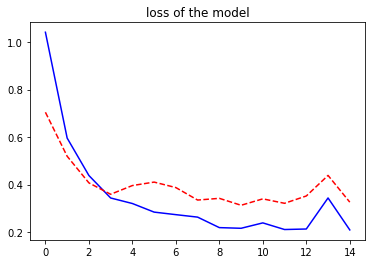
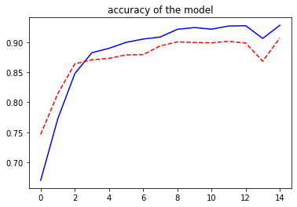

# LAB 9-2 합성곱 신경망으로 패션 MNIST 분류를 개선하기
***
### 실습 목표
> CNN을 이용하여 패션 MNIST 데이터를 분류하는 작업을 시도하자. 이 방법과 다층 퍼셉트론을 사용한 방법을 비교하고, 얼마나 성능이 개선되는지 확인해 보자
***


```python
#!pip install tensorflow
```

    Collecting tensorflow
      Downloading tensorflow-2.11.0-cp38-cp38-manylinux_2_17_x86_64.manylinux2014_x86_64.whl (588.3 MB)
         |████████████████████████████████| 588.3 MB 46 kB/s  eta 0:00:01    |██                              | 37.6 MB 6.1 MB/s eta 0:01:30     |███▋                            | 67.3 MB 7.8 MB/s eta 0:01:07     |█████▎                          | 96.2 MB 5.4 MB/s eta 0:01:32     |████████▏                       | 149.5 MB 6.2 MB/s eta 0:01:11     |████████████████▍               | 300.3 MB 6.2 MB/s eta 0:00:47     |████████████████▊               | 308.1 MB 6.2 MB/s eta 0:00:45     |█████████████████▍              | 318.8 MB 6.2 MB/s eta 0:00:44     |█████████████████▊              | 326.6 MB 5.3 MB/s eta 0:00:50     |██████████████████              | 332.5 MB 6.2 MB/s eta 0:00:42     |███████████████████▎            | 354.6 MB 6.2 MB/s eta 0:00:38     |████████████████████████▍       | 447.4 MB 6.1 MB/s eta 0:00:23     |█████████████████████████▎      | 464.1 MB 5.4 MB/s eta 0:00:24     |███████████████████████████▉    | 510.7 MB 5.4 MB/s eta 0:00:15     |█████████████████████████████▌  | 541.8 MB 5.8 MB/s eta 0:00:08
    [?25hRequirement already satisfied: typing-extensions>=3.6.6 in /opt/conda/lib/python3.8/site-packages (from tensorflow) (3.7.4.3)
    Requirement already satisfied: protobuf<3.20,>=3.9.2 in /opt/conda/lib/python3.8/site-packages (from tensorflow) (3.14.0)
    Requirement already satisfied: packaging in /opt/conda/lib/python3.8/site-packages (from tensorflow) (20.8)
    Requirement already satisfied: setuptools in /opt/conda/lib/python3.8/site-packages (from tensorflow) (49.6.0.post20210108)
    Requirement already satisfied: six>=1.12.0 in /opt/conda/lib/python3.8/site-packages (from tensorflow) (1.15.0)
    Requirement already satisfied: h5py>=2.9.0 in /opt/conda/lib/python3.8/site-packages (from tensorflow) (3.1.0)
    Collecting absl-py>=1.0.0
      Downloading absl_py-1.3.0-py3-none-any.whl (124 kB)
         |████████████████████████████████| 124 kB 6.0 MB/s eta 0:00:01
    [?25hCollecting astunparse>=1.6.0
      Downloading astunparse-1.6.3-py2.py3-none-any.whl (12 kB)
    Requirement already satisfied: wheel<1.0,>=0.23.0 in /opt/conda/lib/python3.8/site-packages (from astunparse>=1.6.0->tensorflow) (0.36.2)
    Collecting flatbuffers>=2.0
      Downloading flatbuffers-22.10.26-py2.py3-none-any.whl (26 kB)
    Collecting gast<=0.4.0,>=0.2.1
      Downloading gast-0.4.0-py3-none-any.whl (9.8 kB)
    Collecting google-pasta>=0.1.1
      Downloading google_pasta-0.2.0-py3-none-any.whl (57 kB)
         |████████████████████████████████| 57 kB 5.3 MB/s eta 0:00:011
    [?25hCollecting grpcio<2.0,>=1.24.3
      Downloading grpcio-1.50.0-cp38-cp38-manylinux_2_17_x86_64.manylinux2014_x86_64.whl (4.7 MB)
         |████████████████████████████████| 4.7 MB 6.2 MB/s eta 0:00:01
    [?25hCollecting keras<2.12,>=2.11.0
      Downloading keras-2.11.0-py2.py3-none-any.whl (1.7 MB)
         |████████████████████████████████| 1.7 MB 6.0 MB/s eta 0:00:01
    [?25hCollecting libclang>=13.0.0
      Downloading libclang-14.0.6-py2.py3-none-manylinux2010_x86_64.whl (14.1 MB)
         |████████████████████████████████| 14.1 MB 5.3 MB/s eta 0:00:01    |███▋                            | 1.6 MB 6.1 MB/s eta 0:00:03     |███████████████████████████▌    | 12.1 MB 5.3 MB/s eta 0:00:01
    [?25hCollecting numpy>=1.20
      Downloading numpy-1.23.5-cp38-cp38-manylinux_2_17_x86_64.manylinux2014_x86_64.whl (17.1 MB)
         |████████████████████████████████| 17.1 MB 4.7 MB/s eta 0:00:01    |████▎                           | 2.3 MB 6.0 MB/s eta 0:00:03     |██████████████████▉             | 10.0 MB 6.2 MB/s eta 0:00:02     |██████████████████████▊         | 12.1 MB 4.7 MB/s eta 0:00:02
    [?25hCollecting opt-einsum>=2.3.2
      Downloading opt_einsum-3.3.0-py3-none-any.whl (65 kB)
         |████████████████████████████████| 65 kB 4.4 MB/s eta 0:00:01
    [?25hCollecting tensorboard<2.12,>=2.11
      Downloading tensorboard-2.11.0-py3-none-any.whl (6.0 MB)
         |████████████████████████████████| 6.0 MB 3.2 MB/s eta 0:00:01
    [?25hRequirement already satisfied: requests<3,>=2.21.0 in /opt/conda/lib/python3.8/site-packages (from tensorboard<2.12,>=2.11->tensorflow) (2.25.1)
    Collecting google-auth<3,>=1.6.3
      Downloading google_auth-2.14.1-py2.py3-none-any.whl (175 kB)
         |████████████████████████████████| 175 kB 6.1 MB/s eta 0:00:01
    [?25hCollecting cachetools<6.0,>=2.0.0
      Downloading cachetools-5.2.0-py3-none-any.whl (9.3 kB)
    Collecting google-auth-oauthlib<0.5,>=0.4.1
      Downloading google_auth_oauthlib-0.4.6-py2.py3-none-any.whl (18 kB)
    Collecting markdown>=2.6.8
      Downloading Markdown-3.4.1-py3-none-any.whl (93 kB)
         |████████████████████████████████| 93 kB 3.0 MB/s eta 0:00:01
    [?25hCollecting importlib-metadata>=4.4
      Downloading importlib_metadata-5.0.0-py3-none-any.whl (21 kB)
    Requirement already satisfied: zipp>=0.5 in /opt/conda/lib/python3.8/site-packages (from importlib-metadata>=4.4->markdown>=2.6.8->tensorboard<2.12,>=2.11->tensorflow) (3.4.0)
    Collecting pyasn1-modules>=0.2.1
      Downloading pyasn1_modules-0.2.8-py2.py3-none-any.whl (155 kB)
         |████████████████████████████████| 155 kB 5.9 MB/s eta 0:00:01
    [?25hCollecting pyasn1<0.5.0,>=0.4.6
      Downloading pyasn1-0.4.8-py2.py3-none-any.whl (77 kB)
         |████████████████████████████████| 77 kB 4.9 MB/s eta 0:00:01
    [?25hRequirement already satisfied: chardet<5,>=3.0.2 in /opt/conda/lib/python3.8/site-packages (from requests<3,>=2.21.0->tensorboard<2.12,>=2.11->tensorflow) (4.0.0)
    Requirement already satisfied: idna<3,>=2.5 in /opt/conda/lib/python3.8/site-packages (from requests<3,>=2.21.0->tensorboard<2.12,>=2.11->tensorflow) (2.10)
    Requirement already satisfied: urllib3<1.27,>=1.21.1 in /opt/conda/lib/python3.8/site-packages (from requests<3,>=2.21.0->tensorboard<2.12,>=2.11->tensorflow) (1.26.2)
    Requirement already satisfied: certifi>=2017.4.17 in /opt/conda/lib/python3.8/site-packages (from requests<3,>=2.21.0->tensorboard<2.12,>=2.11->tensorflow) (2020.12.5)
    Collecting requests-oauthlib>=0.7.0
      Downloading requests_oauthlib-1.3.1-py2.py3-none-any.whl (23 kB)
    Requirement already satisfied: oauthlib>=3.0.0 in /opt/conda/lib/python3.8/site-packages (from requests-oauthlib>=0.7.0->google-auth-oauthlib<0.5,>=0.4.1->tensorboard<2.12,>=2.11->tensorflow) (3.0.1)
    Collecting rsa<5,>=3.1.4
      Downloading rsa-4.9-py3-none-any.whl (34 kB)
    Collecting tensorboard-data-server<0.7.0,>=0.6.0
      Downloading tensorboard_data_server-0.6.1-py3-none-manylinux2010_x86_64.whl (4.9 MB)
         |████████████████████████████████| 4.9 MB 6.1 MB/s eta 0:00:01
    [?25hCollecting tensorboard-plugin-wit>=1.6.0
      Downloading tensorboard_plugin_wit-1.8.1-py3-none-any.whl (781 kB)
         |████████████████████████████████| 781 kB 5.8 MB/s eta 0:00:01
    [?25hCollecting tensorflow-estimator<2.12,>=2.11.0
      Downloading tensorflow_estimator-2.11.0-py2.py3-none-any.whl (439 kB)
         |████████████████████████████████| 439 kB 5.7 MB/s eta 0:00:01
    [?25hCollecting tensorflow-io-gcs-filesystem>=0.23.1
      Downloading tensorflow_io_gcs_filesystem-0.28.0-cp38-cp38-manylinux_2_12_x86_64.manylinux2010_x86_64.whl (2.4 MB)
         |████████████████████████████████| 2.4 MB 5.8 MB/s eta 0:00:01
    [?25hCollecting termcolor>=1.1.0
      Downloading termcolor-2.1.1-py3-none-any.whl (6.2 kB)
    Collecting werkzeug>=1.0.1
      Downloading Werkzeug-2.2.2-py3-none-any.whl (232 kB)
         |████████████████████████████████| 232 kB 5.8 MB/s eta 0:00:01
    [?25hCollecting MarkupSafe>=2.1.1
      Downloading MarkupSafe-2.1.1-cp38-cp38-manylinux_2_17_x86_64.manylinux2014_x86_64.whl (25 kB)
    Collecting wrapt>=1.11.0
      Downloading wrapt-1.14.1-cp38-cp38-manylinux_2_5_x86_64.manylinux1_x86_64.manylinux_2_17_x86_64.manylinux2014_x86_64.whl (81 kB)
         |████████████████████████████████| 81 kB 6.3 MB/s eta 0:00:011
    [?25hRequirement already satisfied: pyparsing>=2.0.2 in /opt/conda/lib/python3.8/site-packages (from packaging->tensorflow) (2.4.7)
    Installing collected packages: pyasn1, rsa, pyasn1-modules, cachetools, requests-oauthlib, MarkupSafe, importlib-metadata, google-auth, werkzeug, tensorboard-plugin-wit, tensorboard-data-server, numpy, markdown, grpcio, google-auth-oauthlib, absl-py, wrapt, termcolor, tensorflow-io-gcs-filesystem, tensorflow-estimator, tensorboard, opt-einsum, libclang, keras, google-pasta, gast, flatbuffers, astunparse, tensorflow
      Attempting uninstall: MarkupSafe
        Found existing installation: MarkupSafe 1.1.1
        Uninstalling MarkupSafe-1.1.1:
          Successfully uninstalled MarkupSafe-1.1.1
      Attempting uninstall: importlib-metadata
        Found existing installation: importlib-metadata 3.4.0
        Uninstalling importlib-metadata-3.4.0:
          Successfully uninstalled importlib-metadata-3.4.0
      Attempting uninstall: numpy
        Found existing installation: numpy 1.19.5
        Uninstalling numpy-1.19.5:
          Successfully uninstalled numpy-1.19.5
    Successfully installed MarkupSafe-2.1.1 absl-py-1.3.0 astunparse-1.6.3 cachetools-5.2.0 flatbuffers-22.10.26 gast-0.4.0 google-auth-2.14.1 google-auth-oauthlib-0.4.6 google-pasta-0.2.0 grpcio-1.50.0 importlib-metadata-5.0.0 keras-2.11.0 libclang-14.0.6 markdown-3.4.1 numpy-1.23.5 opt-einsum-3.3.0 pyasn1-0.4.8 pyasn1-modules-0.2.8 requests-oauthlib-1.3.1 rsa-4.9 tensorboard-2.11.0 tensorboard-data-server-0.6.1 tensorboard-plugin-wit-1.8.1 tensorflow-2.11.0 tensorflow-estimator-2.11.0 tensorflow-io-gcs-filesystem-0.28.0 termcolor-2.1.1 werkzeug-2.2.2 wrapt-1.14.1


```python
# 패키지와 데이터 준비
import tensorflow as tf
from tensorflow import keras
import numpy as np
import matplotlib.pyplot as plt

# 패션 MNIST 데이터를 학습용 데이터, 테스트 데이터로 구분
fashion_mnist = keras.datasets.fashion_mnist
(train_images, train_labels), (test_images, test_labels) = fashion_mnist.load_data()
```

    Downloading data from https://storage.googleapis.com/tensorflow/tf-keras-datasets/train-labels-idx1-ubyte.gz
    29515/29515 [==============================] - 0s 1us/step
    Downloading data from https://storage.googleapis.com/tensorflow/tf-keras-datasets/train-images-idx3-ubyte.gz
    26421880/26421880 [==============================] - 5s 0us/step
    Downloading data from https://storage.googleapis.com/tensorflow/tf-keras-datasets/t10k-labels-idx1-ubyte.gz
    5148/5148 [==============================] - 0s 0us/step
    Downloading data from https://storage.googleapis.com/tensorflow/tf-keras-datasets/t10k-images-idx3-ubyte.gz
    4422102/4422102 [==============================] - 1s 0us/step


```python
# 학습 이미지 형태 출력
print(train_images.shape)
# 학습 레이블 출력
print(train_labels)
# 테스트 이미지 형태 출력
print(test_images.shape)
```

    (60000, 28, 28)
    [9 0 0 ... 3 0 5]
    (10000, 28, 28)


```python
# 이미지의 채널의 개수에 따라 흑색조, 색감 등등 이미지의 형태가 나뉜다
# mnist데이터 셋의 이미지는 흑색조이기에 채널 정보가 없다
# 차원 수를 늘리는데 자주 사용하는 넘파이의 newaxis를 활용하여 마지막 에 차원을 채워준다
train_images = train_images[:, :, :, np.newaxis]
test_images = test_images[:, :, :, np.newaxis]
```


```python
# 케라스의 Sequential 클래스에 계층을 쌓기
model = keras.models.Sequential([
    # 28*28 입력층을 통해 28*28 32장 Conv2D
    keras.layers.Conv2D(input_shape = (28, 28, 1),
                       kernel_size = (3,3), padding = 'same',
                       filters = 32),
    # 14*14 32장 MaxPooling
    keras.layers.MaxPooling2D((2, 2), strides=2),
    # 14*14 64장 Conv2D
    keras.layers.Conv2D(kernel_size = (3,3), padding ='same',
                       filters = 64),
    # 7*7 64장 MaxPooling
    keras.layers.MaxPooling2D((2, 2), strides=2),
    # 7*7 32장 Conv2D
    keras.layers.Conv2D(kernel_size = (3,3), padding ='same',
                       filters = 32),
    # 1568개의 데이터로 flatten화
    keras.layers.Flatten(),
    # 밀집연결 relu활용
    keras.layers.Dense(128, activation = 'relu'),
    # 밀집연결 relu활용
    keras.layers.Dense(32, activation = 'relu'),
    # 10개의 노트 Softmax 출력
    keras.layers.Dense(10, activation = 'softmax')
])
```


```python
model.summary()
```

    Model: "sequential"
    _________________________________________________________________
     Layer (type)                Output Shape              Param #   
    =================================================================
     conv2d (Conv2D)             (None, 28, 28, 32)        320       
                                                                     
     max_pooling2d (MaxPooling2D  (None, 14, 14, 32)       0         
     )                                                               
                                                                     
     conv2d_1 (Conv2D)           (None, 14, 14, 64)        18496     
                                                                     
     max_pooling2d_1 (MaxPooling  (None, 7, 7, 64)         0         
     2D)                                                             
                                                                     
     conv2d_2 (Conv2D)           (None, 7, 7, 32)          18464     
                                                                     
     flatten (Flatten)           (None, 1568)              0         
                                                                     
     dense (Dense)               (None, 128)               200832    
                                                                     
     dense_1 (Dense)             (None, 32)                4128      
                                                                     
     dense_2 (Dense)             (None, 10)                330       
                                                                     
    =================================================================
    Total params: 242,570
    Trainable params: 242,570
    Non-trainable params: 0
    _________________________________________________________________


```python
# 모델 컴파일 후 학습
model.compile(optimizer='adam',
             loss='sparse_categorical_crossentropy',
             metrics=['accuracy'])
# 학습에 과정에서 손실 값과 정확도 history에 기록 (15 에폭, 25% 검증에 사용)
history = model.fit(train_images, train_labels,
                   epochs=15, validation_split=0.25)
```

    Epoch 1/15
    1407/1407 [==============================] - 12s 8ms/step - loss: 1.0411 - accuracy: 0.6703 - val_loss: 0.7043 - val_accuracy: 0.7467
    Epoch 2/15
    1407/1407 [==============================] - 10s 7ms/step - loss: 0.5957 - accuracy: 0.7725 - val_loss: 0.5191 - val_accuracy: 0.8142
    Epoch 3/15
    1407/1407 [==============================] - 11s 8ms/step - loss: 0.4381 - accuracy: 0.8478 - val_loss: 0.4071 - val_accuracy: 0.8641
    Epoch 4/15
    1407/1407 [==============================] - 10s 7ms/step - loss: 0.3435 - accuracy: 0.8826 - val_loss: 0.3591 - val_accuracy: 0.8707
    Epoch 5/15
    1407/1407 [==============================] - 11s 7ms/step - loss: 0.3202 - accuracy: 0.8898 - val_loss: 0.3958 - val_accuracy: 0.8731
    Epoch 6/15
    1407/1407 [==============================] - 10s 7ms/step - loss: 0.2840 - accuracy: 0.8997 - val_loss: 0.4104 - val_accuracy: 0.8789
    Epoch 7/15
    1407/1407 [==============================] - 10s 7ms/step - loss: 0.2733 - accuracy: 0.9052 - val_loss: 0.3873 - val_accuracy: 0.8793
    Epoch 8/15
    1407/1407 [==============================] - 11s 8ms/step - loss: 0.2629 - accuracy: 0.9086 - val_loss: 0.3348 - val_accuracy: 0.8939
    Epoch 9/15
    1407/1407 [==============================] - 10s 7ms/step - loss: 0.2188 - accuracy: 0.9214 - val_loss: 0.3420 - val_accuracy: 0.9005
    Epoch 10/15
    1407/1407 [==============================] - 11s 7ms/step - loss: 0.2159 - accuracy: 0.9244 - val_loss: 0.3128 - val_accuracy: 0.8996
    Epoch 11/15
    1407/1407 [==============================] - 12s 9ms/step - loss: 0.2386 - accuracy: 0.9216 - val_loss: 0.3398 - val_accuracy: 0.8989
    Epoch 12/15
    1407/1407 [==============================] - 11s 8ms/step - loss: 0.2107 - accuracy: 0.9269 - val_loss: 0.3211 - val_accuracy: 0.9014
    Epoch 13/15
    1407/1407 [==============================] - 11s 7ms/step - loss: 0.2129 - accuracy: 0.9274 - val_loss: 0.3519 - val_accuracy: 0.8986
    Epoch 14/15
    1407/1407 [==============================] - 11s 8ms/step - loss: 0.3436 - accuracy: 0.9063 - val_loss: 0.4385 - val_accuracy: 0.8685
    Epoch 15/15
    1407/1407 [==============================] - 11s 8ms/step - loss: 0.2091 - accuracy: 0.9281 - val_loss: 0.3260 - val_accuracy: 0.9069


```python
plt.plot(history.history['loss'], 'b-')
plt.plot(history.history['val_loss'], 'r--')
plt.title("loss of the model")
```


    Text(0.5, 1.0, 'loss of the model')


    

    


```python
plt.plot(history.history['accuracy'], 'b-')
plt.plot(history.history['val_accuracy'], 'r--')
plt.title("accuracy of the model")
# 정확도가 일정 수준을 넘었고 훈련 모델의 정확도가 테스트 모델의 정확도보다 크게 나타나기에 과소적합이 일어 나지 않은 좋은 모델이라는 것을 볼 수 있다.
```


    Text(0.5, 1.0, 'accuracy of the model')


    

    


```python
# 훈련 과정에 사용하지 않은 테스트용 데이터로 모델 정확도 측정
test_loss, test_acc = model.evaluate(test_images, test_labels, verbose=2)
print('테스트 정확도:', test_acc)
```

    313/313 - 1s - loss: 0.3286 - accuracy: 0.9051 - 808ms/epoch - 3ms/step
    테스트 정확도: 0.9050999879837036


```python
# 클래스를 나타내는 정수를 문자열로 바꾸기위한 문자열 리스트
class_names = ['T-shirt/top', 'Trouser', 'Pullover', 'Dress', 'Coat', 'Sandal', 'Shirt', 'Sneaker', 'Bag', 'Ankle boot']
```


```python
# 0부터 999까지 랜덤숫자
randIdx = np.random.randint(0, 1000)

# 25개의 이미지 데이터
images = test_images[randIdx:randIdx+25]

# 각 예측별 가장 확률 높은 결과들 뽑아 저장
predictions = np.argmax(model.predict(images), axis=1)
# 저장된 예측 값들 출력
print(predictions)
```

    1/1 [==============================] - 0s 107ms/step
    [4 2 0 5 2 1 2 1 3 0 9 1 0 9 3 6 7 9 9 4 4 7 1 2 1]


```python
# 이미지와 레이블을 각 행당 5개씩 보여주는 함수 생성
def plot_images(images, labels, images_per_row=5):
    n_images = len(images)
    # 몇개의 행인지
    n_rows = (n_images-1) // images_per_row + 1
    fig, ax = plt.subplots(n_rows, images_per_row,
                          figsize = (images_per_row * 2, n_rows * 2))
    for i in range(n_rows):
        for j in range(images_per_row):
            # 더이상 데이터가 없으면 정지
            if i*images_per_row + j >= n_images: break
            img_idx = i*images_per_row + j
            # 이미지를 28,28형식으로 재배치
            a_image = images[img_idx].reshape(28,28)
            if n_rows>1: axis = ax[i, j]
            # 행이 1개밖에 없으면 굳이 2차원으로 만들 필요가 없기에 조건식 사용
            else: axis = ax[j]
            # 그림이기에 x축 y축 안보이게 설정
            axis.get_xaxis().set_visible(False)
            axis.get_yaxis().set_visible(False)
            # 각 레이블을 그림 제목에 설정
            label = class_names[labels[img_idx]]
            axis.set_title(label)
            # 이전에 2차원으로 만든 그림을 흑백으로 고해상도의 보간법을 적용
            axis.imshow(a_image, cmap='gray', interpolation='nearest')
```


```python
# 이전의 테스트 이미지 25개를 레이블과 함께 이미지 보여주기
plot_images(images, predictions, images_per_row = 5)
```


    

    


```python
# 난수 발생과 예측을 반복하면 다른 예측 결과 확인 가능

# 0부터 999까지 랜덤숫자
randIdx = np.random.randint(0, 1000)

num = 50

# num개의 이미지 데이터
images = test_images[randIdx:randIdx+num]

# 각 예측별 가장 확률 높은 결과들 뽑아 저장
predictions = np.argmax(model.predict(images), axis=1)

# 이전의 테스트 이미지 num개를 레이블과 함께 이미지 보여주기
plot_images(images, predictions, images_per_row = 5)
```

    2/2 [==============================] - 0s 6ms/step


    

    

